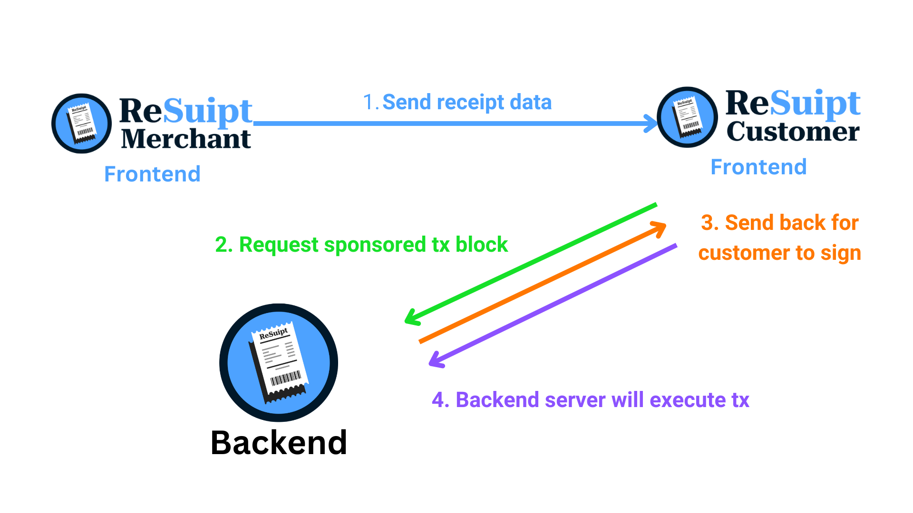
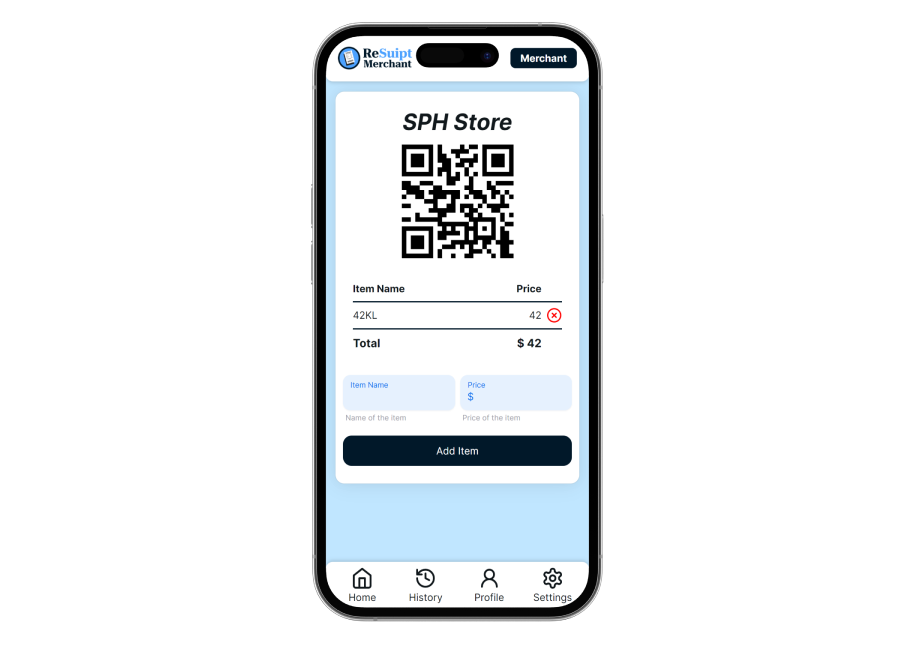

## What is ReSuipt?

ReSuipt is a tool that **digitalizes receipts** with **seamless experience using Sui**.

Merchant decides the receipt data and the customer could scan a QR code to retrieve the recept data and mint the receipt.

All **without the need to remember any seed phrases or private keys**, and the merchant can **sponsor the transaction for the customer to mint the receipt**.

## Sui Features Used

- Object-centric Model
- zkLogin
- Sponsored Transaction
- Programmable Transaction Block
- Transfer to Object
- RPC
- 3rd Party Sui Services (Enoki)
- Dynamic Fields

## Architecture Approaches

The application is built with the following architecture approaches, using Sui features.

These features are done with the [Enoki](https://docs.enoki.mystenlabs.com/ts-sdk/overview) SDK.

### zkLogin

- [Enoki zkLogin](https://docs.enoki.mystenlabs.com/ts-sdk/examples)
- OAuth using google acounts
- Generated a wallet for the user without having the user to remember any seed phrases or private key


### Sposored Transaction

- [Enoki Sponsored Transaction](https://docs.enoki.mystenlabs.com/ts-sdk/sponsored-transactions)
- Merchant can sponsor the transaction for the customer to mint the receipt


## Blockchain for Good

- By [Blockchain for Good Alliance](https://www.blockchainforgood.xyz)
- Targetting <b>Sustainable Development</b></br>
- <b>Goal:</b> Promote sustainable development, addressing environmental issues and achieving economic sustainable growth <br><br>

## Prerequisite

- node.js >= 20
- sui cli >= 1.29.2 ([link](https://docs.sui.io/guides/developer/getting-started/sui-install) to installation guide)

## Get Started

You'll need to host 3 different services to run the application.

- <b>Merchant</b>: For providing the receipt data
- <b>Customer</b>: For scanning the QR code and minting the receipt
- <b>Backend</b>: For sponsoring the transaction



### Merchant frontend

This will host the merchant frontend on localhost at port `5173`

```bash
cd merchant-frontend
npm install
npm run dev
```



### Customer frontend

This will host the customer frontend on localhost at port `5174`

```bash
cd customer-frontend
npm install
npm run dev
```


### Backend

You will first need to deploy the contracts with the deploy script.

> The deploy script will save the packageId of the deployed contract in a file called `deployed-objects.json` which is stored in the `src/` directory.

By default, a `deployed-objects.json` file is already provided in the `src/` directory, deployed by a different address already.

However if you want to deploy the contract with your own address, you can do so by running the following commands:

This will deploy Sui move package (smart contract) onto Sui `Testnet`

> **_NOTE:_** Make sure your sui cli env is using testnet (https://fullnode.testnet.sui.io:443).

> **_NOTE:_** Make sure your sui client active address has enough gas tokens.

```bash
cd backend
npm install
npm run deploy
```

Afterwards, you can proceed to host the backend express service on localhost at port `8080`

```bash
# Assuming you're still in the same directory
npm run index
```

### Deploy Sui Move Package

You can also manually deploy the Sui move package with the Sui CLI.

This will deploy Sui move package (smart contract) onto Sui `Testnet`

> **_NOTE:_** Make sure your sui cli env is using testnet (https://fullnode.testnet.sui.io:443).

> **_NOTE:_** Make sure your sui client active address has enough gas tokens.

```bash
cd resuipt_contracts
sui move build
sui client publish
```

## Team members

- [@DoughnutsNCookies](https://www.github.com/DoughnutsNCookies)
- [@nuyiep](https://www.github.com/nuyiep)
- [@hiromasa0629](https://www.github.com/hiromasa0629)

> Participants of Bridg3 Hackathon 2024
