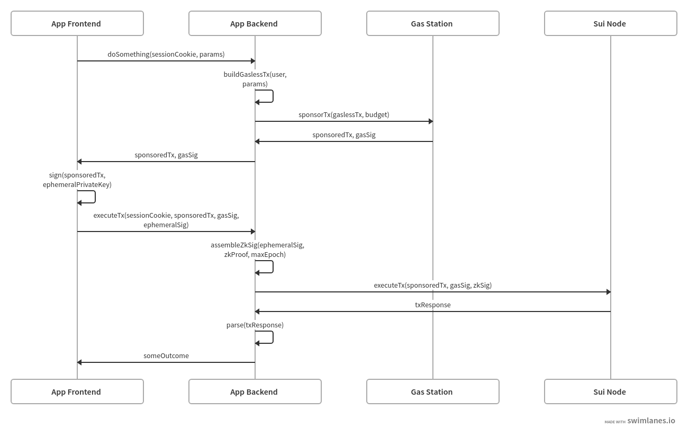

# Bridg3-Hackathon-ReSuipt


ReSuipt is a tool that digitalizes receipts with seamless experience using Sui. Merchant decides the receipt data and customer could scan a QR code to retrieve the recept data and mint the receipt.

## Sui features used

- Object-centric model
- zkLogin
- Sponsored Transaction
- Programmable Tranasction Block
- Transfer to Object
- RPC
- 3rd Party Sui services

## Architecture Approaches

### zkLogin

- [Enokie zkLogin](https://docs.enoki.mystenlabs.com/ts-sdk/examples)
- OAuth using google acounts
- Generated a wallet for the user without having the user to remember any seed phrases or private key

### Sposored Transaction

- [Enoki Sponsored Transaction](https://docs.enoki.mystenlabs.com/ts-sdk/sponsored-transactions)



## Blockchain for Good

- <b>Track 1: Security and Transparency </b> </br>
<b>Goal:</b> Enhance the transparency, traceability, and security of business operations using blockchain technology <br><br>
- <b> Track 2: Sustainable Development </b> </br>
<b>Goal:</b> Promote sustainable development, addressing environmental issues and achieving economic sustainable growth <br><br>

## Prerequisite

- node.js >= 20
- sui cli >= 1.29.2 ([link](https://docs.sui.io/guides/developer/getting-started/sui-install) to installation guide)

## Get Started

### Merchant frontend

This will host the merchant frontend on localhost at port `5173`

```bash
cd merchant-frontend
npm install
npm run dev
```

### Customer frontend

This will host the customer frontend on localhost at port `5174`

```bash
cd customer-frontend
npm install
npm run dev
```

### Backend

This will host the backend express service on localhost at port `8080`

```bash
cd backend
npm install
npm run index
```

### Deploy Sui Move package

This will deploy Sui move package (smart contract) onto Sui `Testnet`

> **_NOTE:_** Make sure your sui cli env is using testnet.

> **_NOTE:_** Make sure your sui client active address has enough gas tokens.

```bash
cd resuipt_contracts
sui move build
sui client publish
```
