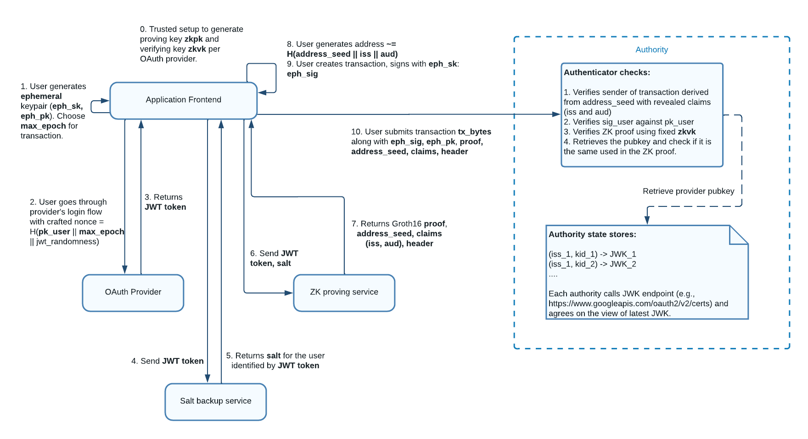
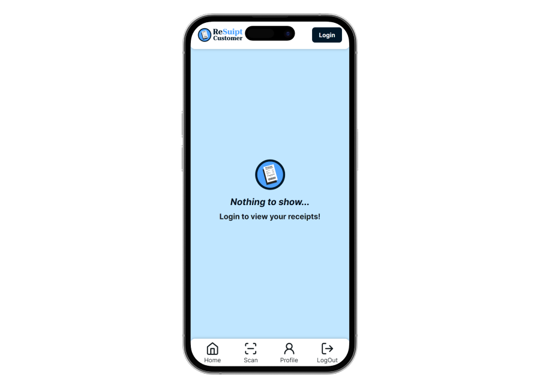

## What is ReSuipt?

ReSuipt is a tool that **digitalizes receipts** with **seamless user experience using Sui**.

Merchant decides the receipt data and the customer could scan a QR code to retrieve the recept data and mint the receipt.

All **without the need to remember any seed phrases or private keys**, and the merchant can **sponsor the transaction for the customer to mint the receipt**.

## Sui Features Used

- Object-centric Model
- zkLogin
- Sponsored Transaction
- Programmable Transaction Block
- Transfer to Object
- RPC
- 3rd Party Sui Services (Enoki)
- Dynamic Fields

## Architecture Approaches

The application is built with the following architecture approaches, using Sui features.

These features are done with the [Enoki](https://docs.enoki.mystenlabs.com/ts-sdk/overview) SDK.

### zkLogin

- [Enoki zkLogin](https://docs.enoki.mystenlabs.com/ts-sdk/examples)
- OAuth using google acounts
- Generated a wallet for the user without having the user to remember any seed phrases or private key



### Sposored Transaction

- [Enoki Sponsored Transaction](https://docs.enoki.mystenlabs.com/ts-sdk/sponsored-transactions)
- Merchant can sponsor the transaction for the customer to mint the receipt


## Blockchain for Good

- By [Blockchain for Good Alliance](https://www.blockchainforgood.xyz)
- Targetting <b>Sustainable Development</b></br>
- <b>Goal:</b> Promote sustainable development, addressing environmental issues and achieving economic sustainable growth <br><br>

Sustainable Development Goals (SDGs) that ReSuipt is targetting:

> These are collapsable sections with some facts of the problem and the result of our solution

<details>
<summary>Goal 3: Good Health and Well-being</summary>
<b>Problem</b>:
<br>
93% of paper receipts are made from thermal paper, coated with toxins (BPA/BPS)
<br>
<br>
These are dangerous to reproductive systems in humans. Meaning high risk to pregnant, nursing women, infants, toddlers
<br>
<br>

<b>Result</b>:
<br>
By digitalizing receipts, we can reduce the use of thermal paper and reduce the risk of exposure to BPA/BPS

</details>
<details>
	<summary>Goal 9: Industry, Innovation, and Infrastructure</summary>
	<b>Problem</b>:
	<br>
	The rapid shift towards digital technologies, might exacerbate the digital divide, potentially marginalizing lower-income populations who may lack access to necessray digital literacy skills
	<br>
	<br>

<b>Result</b>:
<br>
Using ReSuipt can help bridge the digital divide by eliminating the need for complex wallet addresses or seed phrases, allowing everyone to access secure, decentralized financial services with the simplicity of familiar logins (such as Google login)

</details>
<details>
	<summary>Goal 10: Reduced Inequality</summary>
	<b>Problem</b>:
	<br>
	Lower-income individuals lacks financial literacy
	<br>
	<br>

<b>Result</b>:
<br>
Digital receipts can be easily stored, searched, and analyzed, allowing users to track their expenses, manage budgets, and make informed financial decisions. regardless of their economic status

</details>
<details>
	<summary>Goal 11: Sustainable Cities and Communities</summary>
	<b>Problem</b>:
	<br>
	More than 10 million trees are cut down each year purely for the production of paper receipts
	<br>
	<br>

<b>Result</b>:
<br>
By opting for digital receipts, we can save more than 10 million trees per year

</details>
<details>
	<summary>Goal 12: Responsible Consumption and Production</summary>
	<b>Problem</b>:
	<br>
	79.5 billion litres of water are used each year in the process of producing of paper receipts
	<br>
	<br>

<b>Result</b>:
<br>
By digitalising receipts, we could save 79.5 billion litres of water each year. This water conversation could sustain 2.9 million people, aligning with responsible consumption practices

</details>
<details>
	<summary>Goal 13: Climate Action</summary>
	<b>Problem</b>:
	<br>
	One paper receipt generates 4g of CO2. Transitioning from paper to digital receipts could significantly reduce carbon emissions
	<br>
	<br>

<b>Result</b>:
<br>
Reduced carbon emissions contributes to global efforts to limit temperature rise to 1.5°C above pre-industrial levels, aligning with key climate action goals

</details>
<details>
	<summary>Goal 14: Life Below Water</summary>
	<b>Problem</b>:
	<br>
	93% of paper receipts are made from thermal paper, coated with toxins (BPA/BPS)
	<br>
	<br>
	These toxins can leech into waterways, harming aquatic life
	<br>
	<br>

<b>Result</b>:
<br>
By digitalising receipts, we can reduce the use of thermal paper and reduce the risk of toxic chemicals leeching into waterways, thereby protecting aquatic ecosystems and marine life from harmful contamination

</details>
<details>
	<summary>Goal 15: Life on Land</summary>
	<b>Problem</b>:
	<br>
	Paper receipt production contributes to deforestation, destroying habitats for terrestrial species
	<br>
	<br>
	BPA/BPS used in thermal paper receipts can contaminate soil when improperly disposed
	<br>
	<br>

<b>Result</b>:
<br>
By digitaling receipts, we can reduce paper demand, thereby preserving biodiversity. Also, we can minimize soil contamination from receipt disposal

</details>

## Prerequisite

- node.js >= 20
- sui cli >= 1.29.2 ([link](https://docs.sui.io/guides/developer/getting-started/sui-install) to installation guide)

## Get Started

You'll need to host 3 different services to run the application.

- <b>Merchant</b>: For providing the receipt data
- <b>Customer</b>: For scanning the QR code and minting the receipt
- <b>Backend</b>: For sponsoring the transaction


### Merchant frontend

This will host the merchant frontend on localhost at port `5173`

```bash
cd merchant-frontend
npm install
npm run dev
```


### Customer frontend

This will host the customer frontend on localhost at port `5173`. If you've already hosted the merchant frontend from earlier, then it will default to port `5174` instead.

```bash
cd customer-frontend
npm install
npm run dev
```


### Backend

You will first need to deploy the contracts with the deploy script.

> The deploy script will save the packageId of the deployed contract in a file called `deployed-objects.json` which is stored in the `src/` directory.

By default, a `deployed-objects.json` file is already provided in the `src/` directory, deployed by a different address already.

However if you want to deploy the contract with your own address, you can do so by running the following commands:

This will deploy Sui move package (smart contract) onto Sui `Testnet`

> **_NOTE:_** Make sure your sui cli env is using testnet (https://fullnode.testnet.sui.io:443).

> **_NOTE:_** Make sure your sui client active address has enough gas tokens.

```bash
cd backend
npm install
npm run deploy
```

Afterwards, you can proceed to host the backend express service on localhost at port `8080`

```bash
# Assuming you're still in the same directory
npm run index
```

### Deploy Sui Move Package

You can also manually deploy the Sui move package with the Sui CLI.

This will deploy Sui move package (smart contract) onto Sui `Testnet`

> **_NOTE:_** Make sure your sui cli env is using testnet (https://fullnode.testnet.sui.io:443).

> **_NOTE:_** Make sure your sui client active address has enough gas tokens.

```bash
cd resuipt_contracts
sui move build
sui client publish
```

## Team members

- [@DoughnutsNCookies](https://www.github.com/DoughnutsNCookies)
- [@nuyiep](https://www.github.com/nuyiep)
- [@hiromasa0629](https://www.github.com/hiromasa0629)

> Participants of Bridg3 Hackathon 2024
